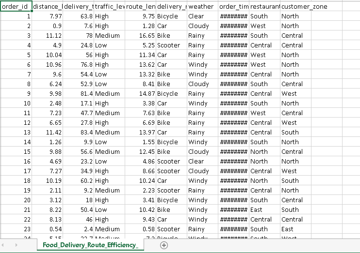
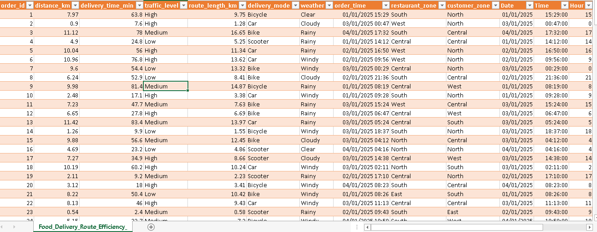
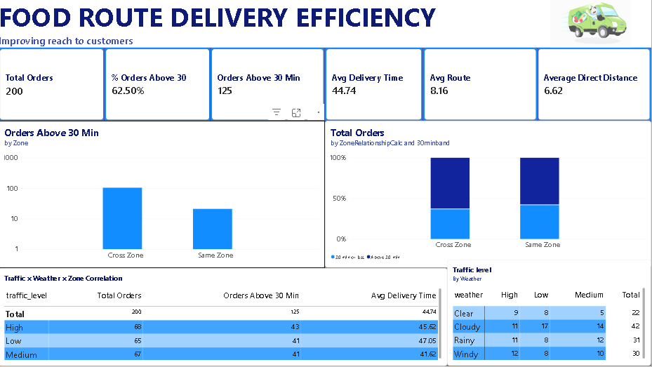

# Food Delivery Route Efficiency — Power BI Analysis

[](https://powerbi.microsoft.com/)
[](#dax-measures)
[]()

A second-stage Power BI analysis of a food delivery operation, focused on **30-minute delivery risk**, **route efficiency**, and the interaction between **traffic, weather, zone relationship, and demand timing**. Built on a proper star-schema semantic model with a full DAX measure library, five report pages, and a drill-through order-detail view.

> This project deliberately does **not** repeat the descriptive averages from the first-pass dashboard. It is a targeted second-stage investigation into *why* deliveries breach the 30-minute threshold and where route geometry, conditions, and demand overlap to create risk.

---

## Table of Contents

- [Business Question](#business-question)
- [Repository Structure](#repository-structure)
- [Data Model](#data-model)
- [Key Modelling Decision](#key-modelling-decision)
- [Report Pages](#report-pages)
- [Key Findings](#key-findings)
- [DAX Measures](#dax-measures)
- [Screenshots](#screenshots)
- [Statistical Validation](#statistical-validation)
- [Tech Stack](#tech-stack)
- [Limitations & Caveats](#limitations--caveats)
- [Author](#author)

---

## Business Question

> **What is driving late deliveries (>30 minutes), and where does the business have the most exposure?**

The analysis centers on six intersecting dimensions:

```
30-minute delivery risk
        +
Same Zone vs Cross Zone
        +
Traffic × Weather interaction
        +
Demand period
        +
Route / Distance efficiency
        +
Exceptions and multivariable effects
```

---

## Repository Structure

```
Food-Delivery-Route-Efficiency/
├── Food_Delivery_Efficiency/     # Power BI (.pbix) file and supporting data
├── assets/                       # Report screenshots referenced in this README
│   ├── Raw_Data.png              # Source data before cleaning/transformation
│   ├── Cleaned_Data.png          # Modelled data after ETL into the star schema
│   └── Dashboard.png             # Final Power BI report view
└── README.md
```

---

## Data Model

The semantic model follows a **star schema**: a staging table preserves the raw CSV for lineage, and a clean fact/dimension layer powers all reporting.

```
                 DimDate
                    │
DimTime ──────► FactDelivery ◄────── DimDeliveryMode
                    │
                    ├── DimWeather
                    ├── DimTraffic
                    ├── DimRestaurantZone
                    ├── DimCustomerZone
                    └── DimZoneRelationship

          stg_FoodDeliveryRaw ──► FactDelivery
```

**Fact table:** `FactDelivery` — one row per order (`OrderID` as the business key), holding raw quantitative fields (`DistanceKM`, `RouteLengthKM`, `DeliveryTimeMin`) plus derived analytical columns (`RouteGapKM`, `RouteOverheadPct`, `SpeedKMPH`, `Over30Flag`, `SevereDelayFlag`, `TimePeriod`).

**Dimensions:** `DimDate`, `DimTime` (with `TimePeriod` / `PeriodSort`), `DimDeliveryMode`, `DimWeather`, `DimTraffic` (sorted Low → Medium → High), and role-playing zone dimensions `DimRestaurantZone` / `DimCustomerZone` derived from a single physical `DimZone` table, plus `DimZoneRelationship` (Same Zone / Cross Zone).

Relationships are single-direction, dimension → fact, with no many-to-many or accidental bi-directional filters.

**Model validation:**

| Check | Result |
|---|---|
| Fact row count | 200 |
| Distinct Order IDs | 200 |
| Duration mismatches | 0 |
| Zone Relationship mismatches | 0 |
| Date / Time parsing errors | 0 |
| Blank dimension keys | 0 |

---

## Key Modelling Decision

The source data contains `delivery_time_min` but **no independent delivery timestamp**. The model therefore derives one:

```
DeliveryDateTime = OrderDateTime + DeliveryTimeMin
```

...and cross-checks the derived elapsed duration against the source duration for consistency. `DeliveryDateTime` is explicitly documented as **derived**, not source-recorded, and `DeliveryTimeMin` remains the authoritative recorded duration throughout the model.

`ZoneRelationship` is likewise **recomputed** from `RestaurantZoneKey` vs `CustomerZoneKey` rather than trusted from the raw source label, which is retained only as a validation field.

---

## Report Pages

The report is built as **5 pages + 1 drill-through page**, connected by a persistent navigation bar:

`Overview │ >30 Risk │ Demand & Mode │ Route & Distance │ Statistics │ Order Detail`

| Page | Purpose |
|---|---|
| **01 · Overview** | Executive entry point — KPI cards, Route Length vs Delivery Time scatter with trend line, Over-30 Rate by Zone Relationship, Weather × Traffic heatmap, Route Overhead % by Customer Zone |
| **02 · >30-Min Risk** | The five core risk KPIs, zone/traffic/weather breakdowns, top high-risk combinations table, and a daily risk trend line |
| **03 · Demand & Mode** | Fastest delivery mode, weather detail within the fastest mode, orders by hour/period, date × period matrix, demand-vs-delay overlay |
| **04 · Route & Distance** | Distance vs Route Length correlation, Route Length vs Delivery Time correlation, route overhead by zone, and an efficiency quadrant scatter |
| **05 · Statistics & Exceptions** | Key Influencers on `Over30Flag`, a decomposition tree on Average Delivery Time, correlation validation cards, a severe-delay exceptions table, and the explanatory model summary |
| **Order Detail** *(drill-through)* | Full order-level narrative — timing, route, conditions, and geography for any single `OrderID` |

Global slicers (Order Date, Time Period, Zone Relationship, Traffic Level, Weather, Delivery Mode) are synced across Pages 01–05. A reusable tooltip page surfaces Orders, Average Delivery Time, Over-30 Rate, Average Route, Average Distance, and Route Overhead % on hover.

---

## Key Findings

**30-minute risk**

| KPI | Value |
|---|---:|
| Orders > 30 min | **125** |
| > 30 min Rate | **62.5%** |
| Avg time of > 30 min orders | **60.73 min** |
| Same-zone > 30 rate | **58.3%** |
| Cross-zone > 30 rate | **63.4%** |

**Delivery mode**
- Fastest mode by average time: **Car (41.48 min)**
- Most common weather among Car orders: **Cloudy** (13 of 47)
- Fastest weather within Car orders: **Clear (28.47 min)**

**Demand timing**
- Busiest date: **Friday, 3 Jan 2025 — 64 orders**
- Highest-volume period: **Morning — 59 orders**
- Peak single hour: **08:00 — 15 orders**
- Peak three-hour window: **15:00–17:59 — 36 orders**

**Traffic & weather**
- Highest-volume cross-zone segment: **High traffic — 59 orders**
- Highest-volume same-zone segment: **Low traffic — 16 orders**
- Highest weather × traffic volumes (tied at 20 orders): **Cloudy+Low, Rainy+Medium, Windy+High**
- Slowest weather × traffic combination: **Cloudy + Low — 56.18 min average**

**Route efficiency**
- Strongest single predictor of delivery time: **Route Length (r ≈ 0.9467)**
- Distance and Route Length are highly correlated: **r ≈ 0.9674**

---

## DAX Measures

The model ships a dedicated **Measures** table covering:

- **Base measures** — Orders, Total/Average Delivery Minutes, Total/Average Distance, Total/Average Route Length
- **Threshold measures** — Orders Over 30, Over-30 Rate, Average Delivery Time Over/Under 30
- **Zone measures** — Same-Zone / Cross-Zone order counts, average time, average distance, and Over-30 rates
- **Route efficiency** — Route Gap (km), Route Overhead %, Time per Direct/Route KM, Average Delivery Speed (km/h)
- **Demand timing** — Peak Order Date, Peak Order Hour, Peak Order Period (dynamic `TOPN`-based measures that respond to slicers)
- **Delivery mode analysis** — Fastest Delivery Mode, Fastest Mode Average Time, Most Common / Fastest Weather within the fastest mode
- **Traffic × weather interaction** — Highest Over-30 Combination (with a minimum sample-size safeguard of 10 orders to prevent small-cell distortion)
- **Severity** — Severe Delay Orders / Rate (> 90 min)
- **Correlation** — Explicit population-style Pearson correlation measures (Route ↔ Delivery, Distance ↔ Delivery) for in-report validation

**Formatting standard:** minutes as `0.0 "min"`, kilometres as `0.00 "km"`, percentages as `0.0%`, rates/correlations as `0.000`, counts as `#,##0`, speed as `0.00 "km/h"`. All measure names are business-readable — no exposed technical shorthand.

---

## Screenshots

### Raw data
Source data prior to cleaning and transformation.



### Cleaned data
Data after ETL into the star-schema semantic model.



### Dashboard
Final Power BI report view.



---

## Statistical Validation

| Relationship | Correlation (r) |
|---|---:|
| Route Length ↔ Delivery Time | **0.9467** |
| Distance ↔ Delivery Time | **0.9304** |
| Distance ↔ Route Length | **0.9674** |
| Hour ↔ Delivery Time | **0.0174** |

**Explanatory model**

```
Delivery Time ~ Route Length + Traffic + Mode + Weather + Zones

R² ≈ 0.903
RMSE ≈ 7.78 minutes
```

Route Length remains the dominant continuous predictor. This is labelled in-report as **in-sample explanatory modelling** — not a causal or predictive-deployment claim.

---

## Tech Stack

- **Power BI Desktop** — data modelling, DAX, report design
- **Power Query** — staging and ETL from raw CSV into the star schema
- **DAX** — measure layer, dynamic TOPN ranking, Key Influencers, Decomposition Tree
- **SQL Server (DDL)** — reporting-layer schema definition for the star schema (staging + dimensions + fact), with computed/persisted columns for derived fields

---

## Limitations & Caveats

- The dataset spans **four days only** — findings describe this operating window, not a long-term demand trend.
- `DeliveryDateTime` is **derived**, not independently source-recorded.
- Weather and traffic associations with delivery time are **not causal claims** — they are screened alongside route length, not proven independent of it.
- Small subgroup combinations are shown with sample size in tooltips and are not ranked as operational truths without adequate `n`.
- Distance and Route Length are highly collinear (r ≈ 0.9674) and are **not** both entered into the same regression without checking multicollinearity.

---

## Author

**Oluwapelumi Eniitan Atanda (Only-Eni)**
OA Research Analytics
📧 olamideeniitan254@gmail.com
